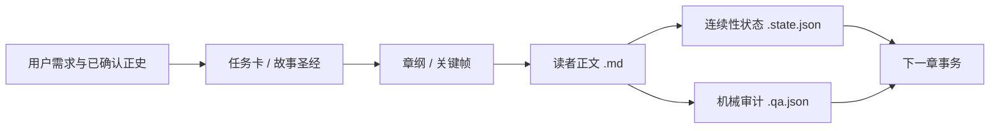

<p align="center">
  
</p>

<p align="center">
  <a href="https://github.com/yiten885-ux/write-xuanhuan-web-fiction-zh/actions/workflows/validate.yml"></a>
  
  
  
</p>

# 玄章天工｜Xuanhuan Storyforge

> 面向中文玄幻长篇创作的状态化写作与审校工作流。

`write-xuanhuan-web-fiction-zh` 是一套可复用的 Codex Skill，覆盖中文玄幻、仙侠、王朝修仙与系统流网文的规划、创作、续写、重写和审校。它把故事圣经、前三章留存设计、逐章节奏二十项硬锁、人物与力量体系、长篇连续性状态、读者正文隔离和确定性机械审计组合成一条完整工作流。

它的目标不是替作者承诺“爆款”，而是在大规模连载中守住可验证的下限：设定不漂移、人物不凭空全知、章节篇幅不被审计文字虚增、内部规则不泄漏进读者正文。

## 核心能力

| 能力 | 解决的问题 | 可验证产物 |
|---|---|---|
| 全书规划 | 从题材承诺到世界、力量、人物弧、卷纲和章纲 | 故事圣经、章卡、关键帧 |
| 开篇工程 | 前三章危机、主动性、阶段胜利、爽点与信息钩子失衡 | 逐章正文与语义检查清单 |
| 章节节奏 | 过渡拖沓、主角被动、反派掉线、战斗对波、支线失控与钩子同质化 | 二十项触发账、滚动窗口与 QA 证据 |
| 长篇连续性 | POV、角色知情、时间、空间、物品持有和伏笔状态漂移 | 版本化 `.state.json` 状态事务 |
| 正文审校 | 有效字数不足、编辑标签泄漏、模板化表达和标题结构异常 | 独立 `.qa.json` 报告与非零失败码 |
| 定向重写 | 在保留正史与用户原文的前提下修复局部问题 | 同一最终正文的聊天交付与文件落盘 |
| 本地优先 | 不把小说、状态或审计数据交给额外服务 | 无 MCP、无第三方凭据、无主动网络请求 |

## 工作模型



读者正文是事实真源。状态文件是从已接受正文派生的索引，QA 是独立审计侧车；三者不得互相混写，也不得用状态或审计文字补足默认每章 2000–3200 个净正文有效字符。

## Codex 与 Harness

| 运行环境 | 支持方式 | 边界 |
|---|---|---|
| Codex | 仓库已提供 marketplace 与 skills-only Plugin 清单 | 可按下方命令安装并调用 |
| 独立 Skill | 直接加载 `plugins/xuanhuan-storyforge/skills/write-xuanhuan-web-fiction-zh/` | 保留 `SKILL.md`、`references/`、`assets/` 与 `scripts/` 的相对结构 |
| Harness | 支持读取 `SKILL.md` 的 Harness 可复用同一 Skill 本体 | 本仓库不宣称适配或认证所有 Harness 实现 |

## 安装

当前 Codex CLI 可将此仓库加入 marketplace，再安装插件：

```bash
codex plugin marketplace add yiten885-ux/write-xuanhuan-web-fiction-zh --ref main
codex plugin marketplace list
codex plugin add xuanhuan-storyforge --marketplace <上一步显示的市场名>
```

若使用本地 checkout：

```bash
codex plugin marketplace add /absolute/path/to/write-xuanhuan-web-fiction-zh
codex plugin marketplace list
codex plugin add xuanhuan-storyforge --marketplace <上一步显示的市场名>
```

Harness 用户应按其自身的 Skill 加载方式，指向：

```text
plugins/xuanhuan-storyforge/skills/write-xuanhuan-web-fiction-zh/
```

## 调用示例

从零构建长篇：

```text
使用 $write-xuanhuan-web-fiction-zh，从零设计一部中文玄幻网文；先生成故事圣经、力量体系和前三章章纲。
```

直接交付前三章：

```text
使用 $write-xuanhuan-web-fiction-zh，直接生成前三章完整正文，并把聊天中的同一份最终正文保存到指定 Markdown 文件。
```

审校既有正文：

```text
使用 $write-xuanhuan-web-fiction-zh，检查这三章的钩子、爽点、角色动机、连续性和正文净字数；只给证据、风险与改法。
```

## 本地验证

运行全部 Skill 合同与回归测试：

```bash
python3 -m unittest discover \
  -s plugins/xuanhuan-storyforge/skills/write-xuanhuan-web-fiction-zh/tests \
  -v
```

审计前三章的标题、逐章净正文长度与末句钩子：

```bash
python3 plugins/xuanhuan-storyforge/skills/write-xuanhuan-web-fiction-zh/scripts/audit_chapter.py \
  manuscript.md \
  --require-title \
  --require-opening-three \
  --json-out manuscript.qa.json
```

校验长篇状态的正文哈希、来源锚、关键帧和相邻版本链：

```bash
python3 plugins/xuanhuan-storyforge/skills/write-xuanhuan-web-fiction-zh/scripts/validate_story_state.py \
  current.state.json \
  --prose manuscript.md \
  --previous previous.state.json \
  --json-out current.qa.json
```

这些检查能证明已覆盖的结构与机械门禁通过，不能单独证明文学质量、读者留存、商业成绩或所有语义连续性。

## 仓库结构

```text
.
├── .agents/plugins/marketplace.json
├── .github/workflows/validate.yml
├── plugins/xuanhuan-storyforge/
│   ├── .codex-plugin/plugin.json
│   ├── assets/
│   └── skills/write-xuanhuan-web-fiction-zh/
│       ├── SKILL.md
│       ├── agents/openai.yaml
│       ├── assets/
│       ├── references/
│       ├── scripts/
│       └── tests/
└── submission/
```

市场展示名为 **玄章天工｜Xuanhuan Storyforge**；稳定的技术 ID 仍为 `write-xuanhuan-web-fiction-zh`，以兼容既有调用。

## 安全、隐私与许可

插件不包含 MCP 服务，不主动发起网络请求，也不要求第三方凭据。审计脚本只读取明确指定的本地文件；使用 `--json-out` 时，报告写入独立侧车文件，默认不记录使用者的绝对路径。

本仓库未授予开源许可。除非权利人另行书面授权，保留全部权利。
